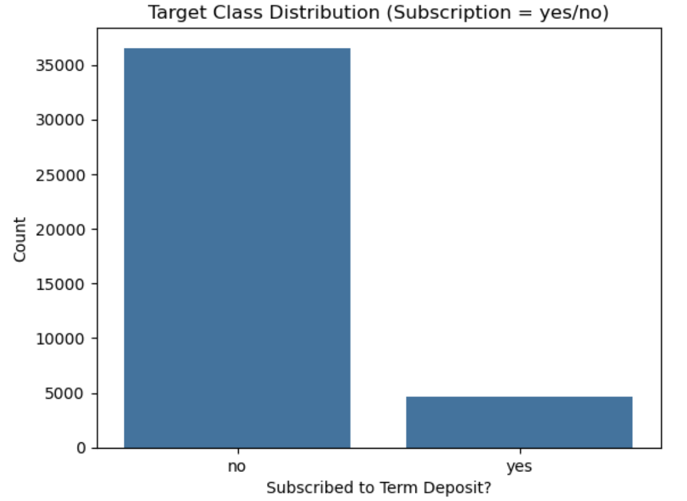

# Call Campaign Response Model

**Can we predict which customers will subscribe to a term deposit offer from a bank?**
## Overview
This project applies machine learning to predict whether a customer will subscribe to a term deposit following a marketing phone call. Using the publicly available Bank Marketing dataset from a Portuguese financial institution, we explore factors influencing customer response and build classification models to support smarter outreach.

The modeling process includes baseline comparisons (Logistic Regression, K-Nearest Neighbors, Decision Tree, and Support Vector Machine), followed by class balancing with SMOTE and hyperparameter tuning using GridSearchCV. Evaluation focuses on accuracy, precision, recall, and F1-score—especially for the minority class (“yes”).

The goal is to enable marketing teams to prioritize leads more effectively, reduce unnecessary outreach, and improve conversion rates. All stages follow the CRISP-DM methodology and are documented in the project notebook [Call_Campaign_Response_Model](./Call_Campaign_Response_Model.ipynb).

## Objective

The objective of this project is to build a reliable classification model that helps a financial institution identify which customers are most likely to subscribe to a term deposit after a marketing phone call.

By predicting the likelihood of a positive response, the model aims to:

- Improve campaign efficiency by targeting high-probability leads
- Minimize false positives to reduce wasted outreach efforts
- Provide interpretable insights to support data-driven marketing strategies

This objective supports business goals of increased conversion, optimized resource allocation, and enhanced customer engagement.

## Requirements

To run this project, you need to have the following Python packages installed:

- pandas
- numpy
- scikit-learn
- matplotlib
- seaborn
- imbalanced-learn
- jupyter

You can install them using:
pip install pandas numpy scikit-learn matplotlib seaborn imbalanced-learn

## Repository Structure

```
Call_Campaign_Response_Model/
│
├── data/                      # Source dataset (bank-additional-full.csv)
├── images/                    # Visuals: EDA plots, confusion matrices, bar plots
├── reports/
│   └── bank_campaign_model_report.md   # Business-facing findings & recommendations
├── used_model_comparison.ipynb         # Jupyter notebook with full pipeline
└── README.md                 # This file
```

## Dataset Summary

The dataset used in this project comes from the [UCI Machine Learning Repository](https://archive.ics.uci.edu/ml/datasets/bank+marketing) and contains client and campaign-related data collected from a Portuguese banking institution. The goal is to predict whether a client will subscribe to a term deposit.
The dataset includes results from **17 marketing campaigns** over 5 years, promoting **term deposit subscriptions** via phone calls. The **target variable** is `y` (yes/no) indicating if the customer subscribed.

### Key Details

- **Total records:** ~41,188
- **Input features:** 20
- **Mixed data types:** of categorical and numerical features
- **Target column:** `y` — indicates if the client subscribed (yes or no)
- **Imbalanced classes:** Only ~11% of customers subscribed ("yes")

### Feature Description

| **Feature**         | **Description**                                                         |
|---------------------|-------------------------------------------------------------------------|
| `age`               | Age of the client                                                       |
| `job`               | Job type (admin., technician, etc.)                                     |
| `marital`           | Marital status (married, single, etc.)                                  |
| `education`         | Educational qualification                                               |
| `default`           | Has credit in default? (yes, no)                                        |
| `balance`           | Average yearly balance in euros                                         |
| `housing`           | Has a housing loan? (yes, no)                                           |
| `loan`              | Has a personal loan? (yes, no)                                          |
| `contact`           | Contact communication type (cellular, telephone)                        |
| `day`               | Last contact day of the month                                           |
| `month`             | Last contact month of year                                              |
| `duration`          | Last contact duration (in seconds) — **dropped** to avoid data leakage  |
| `campaign`          | Number of contacts during this campaign                                 |
| `pdays`             | Days since client was last contacted (999 means never)                  |
| `previous`          | Number of contacts before this campaign                                 |
| `poutcome`          | Outcome of previous campaign (success, failure, etc.)                   |
| `y`                 | Target variable — has the client subscribed? (yes or no)                |

> Note: The `duration` column was dropped during preprocessing as it introduces future information not available at the time of prediction.

## Data Exploration & Preprocessing

### 1. Initial Data Inspection

We started by exploring the **Bank Marketing Dataset** (UCI), which contains information on customers contacted during a telemarketing campaign. The target variable is `y`, a binary indicator of whether the customer subscribed to a term deposit.

- The dataset includes both **categorical** and **numerical** features such as:
  - Categorical: `job`, `marital`, `education`, `default`, `housing`, `loan`, `contact`, `month`, `day_of_week`, `poutcome`
  - Numerical: `age`, `campaign`, `pdays`, `previous`, `emp.var.rate`, `cons.price.idx`, `cons.conf.idx`, `euribor3m`, `nr.employed`, `duration` (later dropped)

- **Class imbalance**: Only ~11% of customers subscribed ("yes"). Most models would otherwise default to predicting "no."

## Exploratory Data Analysis (EDA)

To understand relationships between features and the target, we performed exploratory data analysis (EDA). Key insights include:

### 1. Correlation Matrix

- Revealed potential collinearity between economic indicators like `euribor3m` and `nr.employed`.
- No single feature showed strong correlation with the target, reinforcing the need for multivariate modeling.

**Correlation Matrix Heatmap:**


### 2. Class Distribution

- The target variable `y` is highly imbalanced: only ~11% of customers subscribed.
- Reinforced the need for SMOTE to balance training data.




### 3. Histograms of Key Features

- Skewed distributions observed in `campaign`, `pdays`, `previous`
- Features like `age` and `duration` had wider spread and needed attention during scaling or feature selection.


### 4. Box Plots

- Outliers found in `pdays` and `campaign`.
- These were preserved to avoid overfitting, but scaled appropriately.


### 2. Preprocessing Steps

#### Data Cleaning

- **Dropped `duration`** since it leaks target information (only known after a successful call).
- Checked for missing values and confirmed clean schema.
- Converted categorical features to strings (where needed) to support encoding.

#### Encoding Categorical Variables

- Applied **One-Hot Encoding** using `ColumnTransformer`.
- Ensured compatibility across all models without introducing ordinal bias.

#### Handling Class Imbalance

- Used **SMOTE (Synthetic Minority Oversampling Technique)** on training data only.
- Balanced "yes" and "no" classes to improve model recall.

#### Feature Scaling

- Used **StandardScaler** to normalize numerical features.
- Beneficial for models sensitive to scale (KNN, SVM, Logistic Regression).

### 3. Train-Test Split

- Performed a **stratified train-test split** (80/20) to preserve class distribution.
- **SMOTE** applied only to training data to avoid leakage.

### 4. Observations from EDA

- Majority class ("no") dominates — accuracy is not sufficient.
- Features like `month`, `poutcome`, and `euribor3m` show strong signals.
- Data quality is high with minimal outliers or missing values.
- Correlations and distributions were used to guide preprocessing decisions.

## Data Preparation & Feature Engineering

Before modeling, we performed several preprocessing and feature engineering steps to ensure data quality and improve model performance.

### 1. Dropping Target Leakage
- Removed the `duration` column, which represents call duration and is only known *after* the outcome.
- Including it would cause **data leakage** and inflate model performance unrealistically.

### 2. Encoding Categorical Variables
- Applied **One-Hot Encoding** to all categorical features.
- This allowed models to interpret non-numeric data without assuming an order or ranking.

### 3. Scaling Numerical Features
- Used `StandardScaler` to normalize numerical columns:
  - `age`, `campaign`, `pdays`, `previous`, `emp.var.rate`, `cons.price.idx`, `cons.conf.idx`, `euribor3m`, `nr.employed`
- Scaling helped improve convergence and performance in models sensitive to feature magnitude (e.g., Logistic Regression, SVM).

### 4. Handling Class Imbalance
- The dataset was imbalanced with only ~11% "yes" responses.
- Applied **SMOTE (Synthetic Minority Oversampling Technique)** to the training set.
- This created a more balanced class distribution and improved model learning on the minority class.

### 5. Final Feature Set
The final dataset included a combination of scaled numeric features and encoded categorical variables — ready for training and evaluation.

## Modeling Approach Summary

| Step                  | Action                                                                 |
|-----------------------|------------------------------------------------------------------------|
| Data Cleaning         | Dropped `duration` (target leakage), verified no missing values        |
| Feature Encoding      | Applied One-Hot Encoding to categorical features                       |
| Scaling               | Used StandardScaler for numerical variables                           |
| Class Imbalance Fix   | Applied SMOTE on training set to balance classes                       |
| Models Trained        | Logistic Regression, K-Nearest Neighbors (KNN), Decision Tree, SVM     |
| Hyperparameter Tuning | GridSearchCV with StratifiedKFold (k=5), optimizing for F1 (Yes class) |


## Model Training & Tuning

### Baseline Models (Before Tuning)

We initially trained four classification models using default settings to establish baseline performance.

Models Trained:
- Logistic Regression
- K-Nearest Neighbors (KNN)
- Decision Tree
- Support Vector Machine (SVM)

Each model was evaluated using Accuracy, Precision, Recall, F1-Score, and Confusion Matrices — focusing on the "yes" (positive) class.

#### Performance Summary (Baseline)

| Model                   | Accuracy | F1 Score (Yes) | Precision (Yes) | Recall (Yes) |
|------------------------|----------|----------------|------------------|---------------|
| Logistic Regression    | 0.8998   | 0.4497         | 0.5816           | 0.3637        |
| K-Nearest Neighbors    | 0.8873   | 0.2692         | 0.6232           | 0.1735        |
| Decision Tree          | 0.8814   | **0.5120**         | 0.5415           | **0.4854**        |
| Support Vector Machine | **0.9058**   | 0.3803         | **0.6832**           | 0.2626        |

Key Insight:
- Decision Tree had the highest F1-Score, offering the most balanced performance.
- SVM achieved the best accuracy and precision but had low recall.
- KNN struggled to identify the positive class.

### Tuning & Optimization

To improve predictions on the minority class, we enhanced our approach with the following:

Improvements Applied:
- Dropped `duration` to prevent target leakage
- One-Hot Encoded all categorical variables
- Applied StandardScaler to numeric columns
- Used SMOTE to balance the training set
- Tuned models using GridSearchCV with StratifiedKFold
- Selected F1-Score as the primary evaluation metric

Best Parameters Searched:
- Logistic Regression: C, solver
- KNN: n_neighbors
- Decision Tree: max_depth, min_samples_split
- SVM: C, gamma, kernel

#### Performance Summary (Tuned Models)

| Model                   | Accuracy | F1 Score (Yes) | Precision (Yes) | Recall (Yes) |
|------------------------|----------|----------------|------------------|---------------|
| Logistic Regression    | 0.82   | 0.4576         | 0.3494           | **0.6627**        |
| K-Nearest Neighbors    | 0.79   | 0.3623         | 0.2724           | 0.5409        |
| Decision Tree          | 0.88   | **0.4896**         | 0.4837           | **0.4957**        |
| Support Vector Machine | **0.87**   | 0.5002         | 0.4546           | 0.5560        |

**Key Insight:**
- SVM delivered strong F1 and precision after tuning.
- Decision Tree continued to offer the best balance of recall and precision.
- Logistic Regression provided high recall, making it useful when coverage matters most.

### Key Visuals

1. Confusion Matrices (Tuned Models)  
Location: `images/pa3_tuned_model_confusion_matrices.png`

2. Accuracy vs F1 Score Bar Plot  
Location: `images/pa3_tuned_accuracy_vs_f1_barplot.png`

These visualizations help illustrate trade-offs between model accuracy and their ability to capture positive class predictions.

## Conclusion

This project applied classification models to predict whether a customer will respond positively to a term deposit offer from a bank. Using the Portuguese Bank Marketing Dataset, we built, evaluated, and compared multiple models — starting with default classifiers and improving performance through hyperparameter tuning and class balancing using SMOTE.

The business goal was to optimize marketing outreach by prioritizing customers likely to say "yes." From a modeling perspective, we emphasized F1-score and recall due to the imbalanced dataset (~11% positive class).


## Key Takeaways

- SMOTE significantly improved **recall** across all models by oversampling the "yes" class during training.
- **Decision Trees** offered the best **F1-score**, striking a balance between precision and recall.
- **Support Vector Machines (SVM)** achieved the highest accuracy and precision, but with lower recall.
- **Logistic Regression** trained fast and showed strong recall post-SMOTE, making it ideal for broad outreach.
- **K-Nearest Neighbors** underperformed, especially on the minority class, and is not recommended.


## Business Recommendations

Based on our modeling results and campaign strategy needs, we recommend the following:

| Goal                             | Recommended Model            | Why It Matters                                               |
|----------------------------------|------------------------------|--------------------------------------------------------------|
| High Precision Outreach          | SVM                          | Reduces false positives; saves sales reps time               |
| Broad Outreach (Max Recall)      | Logistic Regression + SMOTE  | Captures more actual subscribers; good for awareness efforts |
| Balanced Outreach & Interpretability | Decision Tree (Tuned)        | Best F1-Score; interpretable and consistent                  |
| Avoid                            | KNN                          | Missed too many real subscribers; low recall and F1          |

**Use the model that best aligns with your campaign goals:**
- **SVM** when every call must count and false positives are expensive.
- **Decision Tree** for general deployment — interpretable and well-balanced.
- **Logistic Regression + SMOTE** when you want to cast a wider net and increase reach.


## Actionable Insights for Marketing Teams

1. **Precision-Focused Campaigns**  
   Use SVM when outreach resources are limited or expensive — it prioritizes high-confidence "yes" predictions.

2. **Balanced Outreach Strategies**  
   Deploy Decision Trees when both recall and interpretability are important. Great for lead scoring and team dashboards.

3. **Broad Awareness Campaigns**  
   Use Logistic Regression (with SMOTE) when it's acceptable to reach more people, even with some false positives.

4. **Model Deployment Strategy**  
   - Score leads before outreach and integrate with CRM tools.
   - Use confusion matrix thresholds to adjust for business constraints.
   - Automate actions like follow-ups or personalized content based on model predictions.


## Next Steps

- **Deploy Best Model**  
  Host the tuned Decision Tree or SVM model as a microservice (e.g., Flask API) for integration with marketing systems.

- **Explore Ensembles**  
  Evaluate Random Forest and XGBoost for potential uplift over base classifiers.

- **Add More Features**  
  Incorporate prior outreach history, call timing, or engagement metrics from the CRM.

- **Set Up Monitoring**  
  Periodically retrain the model on new campaign data to adapt to shifting customer behavior.


## References

- Dataset: [UCI Bank Marketing Dataset](https://archive.ics.uci.edu/ml/datasets/bank+marketing)  
- Moro, S., Cortez, P., & Rita, P. (2014). A data-driven approach to predict the success of bank telemarketing.
